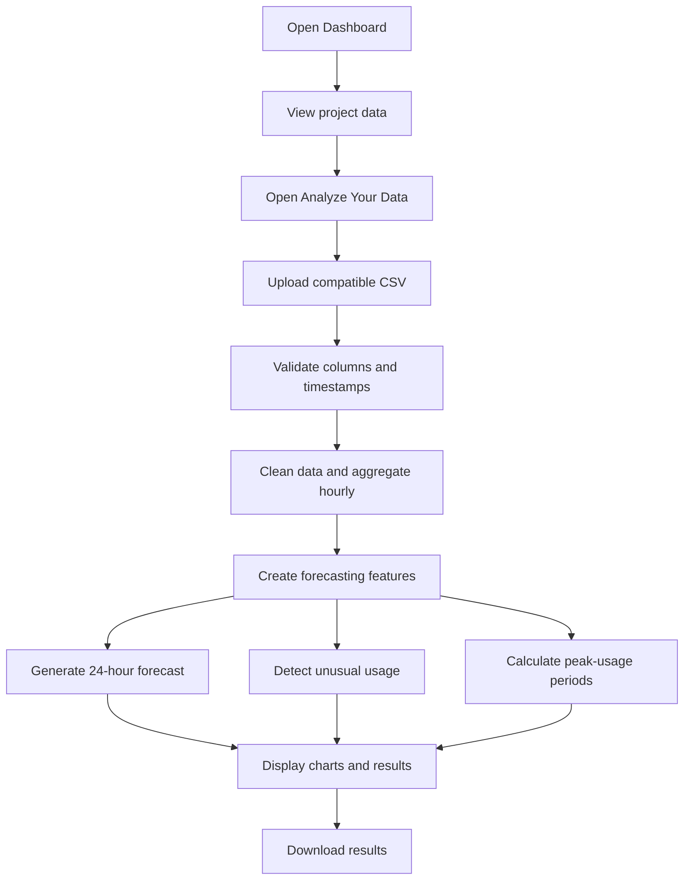
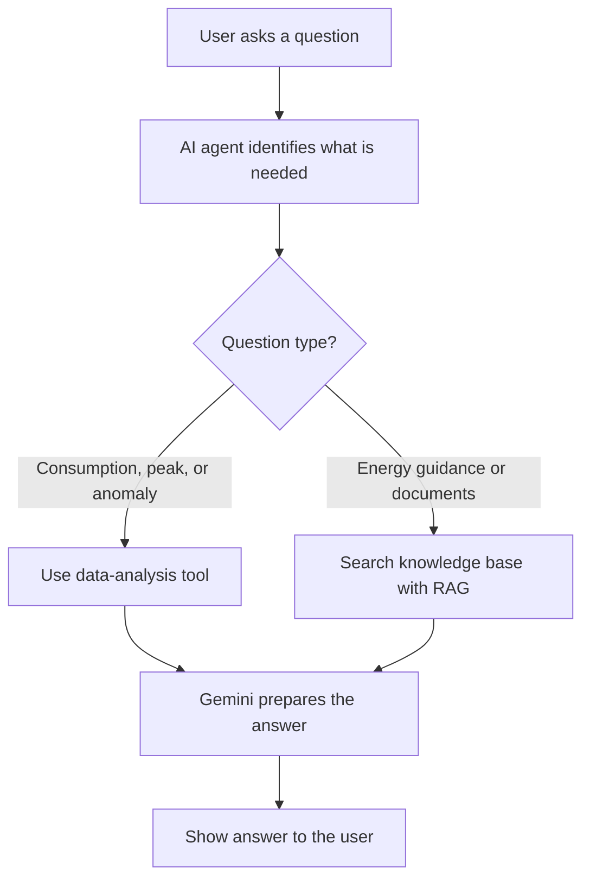

## How the App Works

### Data Analysis Workflow

```mermaid
flowchart TD
    A[Open Dashboard] --> B[View project data]
    B --> C[Open Analyze Your Data]
    C --> D[Upload compatible CSV]
    D --> E[Validate columns and timestamps]
    E --> F[Clean data and aggregate hourly]
    F --> G[Create forecasting features]
    G --> H[Generate 24-hour forecast]
    G --> I[Detect unusual usage]
    G --> J[Calculate peak-usage periods]
    H --> K[Display charts and results]
    I --> K
    J --> K
    K --> L[Download results]
```

### AI Assistant Workflow

```mermaid
flowchart TD
    A[User asks a question] --> B[AI agent identifies what is needed]
    B --> C{Question type?}
    C -->|Consumption, peak, or anomaly| D[Use data-analysis tool]
    C -->|Energy guidance or documents| E[Search knowledge base with RAG]
    D --> F[Gemini prepares the answer]
    E --> F
    F --> G[Show answer to the user]
```
